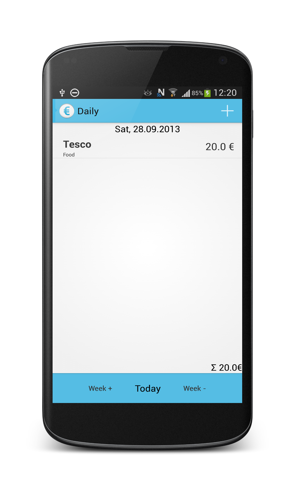
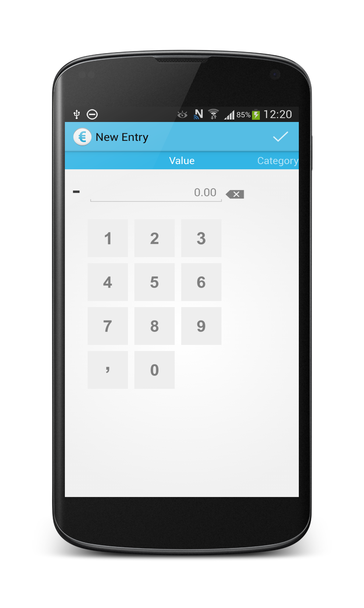
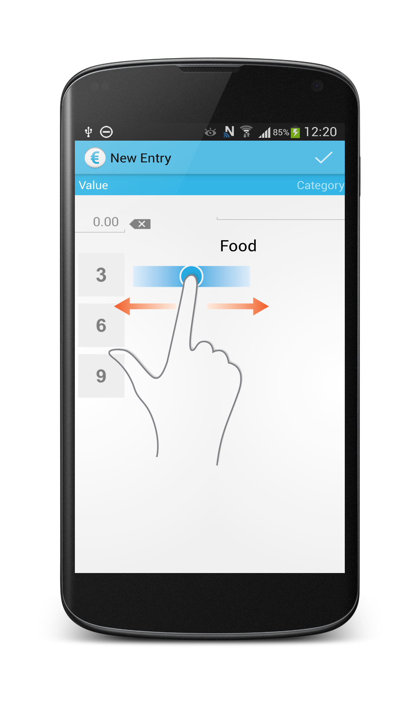
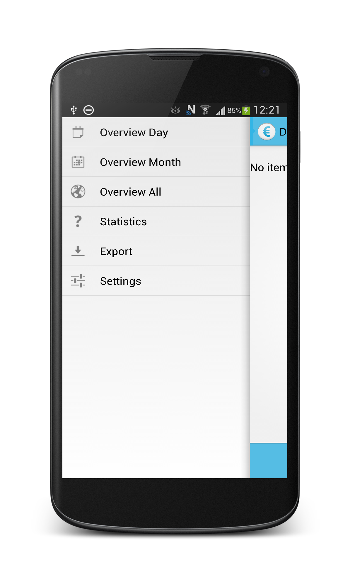

expensetracker
==============
**Still under heavy development!!**

A simple app to track you expenses.  
It is designed to be very simple to input a new entry by single taps and swipe gestures.  

**Features**
- Input expenses with existing categories and descriptions
- Add new categories and Descriptions on the fly
- List expenses per day
- List all expenses 

**Todo**
- Improve stability
- Search/autocomplete for categories and descriptions
- Statistics and visualisation
- Backup and export/import
- Cloud storage connections for backup

Following some screenshots to get an idea how it looks like

     

